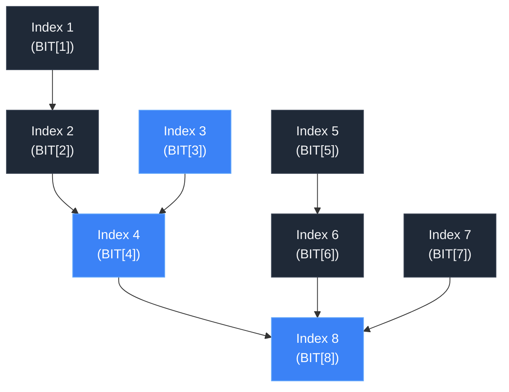

# Fenwick Tree (Binary Indexed Tree) Masterclass

Welcome! If you've ever struggled to balance fast data updates with fast range sum queries, you are in the right place. 

As developers and computer scientists, we constantly encounter trade-offs. The **Fenwick Tree** (also known as the **Binary Indexed Tree**, or **BIT**) is a brilliant data structure that solves a classic conflict: balancing the speed of updating an element with the speed of querying a range.

This guide will walk you through the core intuition, bitwise operations, step-by-step visualizations, and a production-grade C++ implementation. Let's dive in!

---

## 1. The Core Intuition & The "Why"

### The Problem
Imagine you have an array $A$ of $N$ numbers, and you need to perform two operations repeatedly:
1. **Point Update:** Add a value (delta) to an element at a specific index (e.g., $A[i] \leftarrow A[i] + \text{delta}$).
2. **Range Query:** Calculate the sum of elements from index $L$ to $R$ (e.g., $\sum_{k=L}^{R} A[k]$).

Let's look at how standard approaches fail to balance these operations:

* **Approach A: Standard Array**
  * **Point Update:** $O(1)$ — you just change the value at the index.
  * **Range Query:** $O(N)$ — you have to loop from $L$ to $R$ and add them up.
  * *Verdict:* Too slow if we have many queries.

* **Approach B: Prefix Sum Array**
  * You precalculate an array `P` where $P[i] = A[1] + A[2] + \dots + A[i]$.
  * **Range Query:** $O(1)$ — the sum from $L$ to $R$ is simply $P[R] - P[L-1]$.
  * **Point Update:** $O(N)$ — changing $A[i]$ forces you to update $P[i], P[i+1], \dots, P[N]$.
  * *Verdict:* Too slow if we have many updates.

### The Fenwick Tree Compromise
The Fenwick Tree achieves an elegant equilibrium. By storing sums over **overlapping, mathematically chosen sub-ranges**, it guarantees:
* **Point Update:** $O(\log N)$
* **Range Query:** $O(\log N)$
* **Space Complexity:** $O(N)$

### Complexity Comparison

| Data Structure | Point Update | Range Query | Space Complexity |
| :--- | :---: | :---: | :---: |
| **Standard Array** | $O(1)$ | $O(N)$ | $O(N)$ |
| **Prefix Sum Array** | $O(N)$ | $O(1)$ | $O(N)$ |
| **Fenwick Tree** | $O(\log N)$ | $O(\log N)$ | $O(N)$ |

---

## 2. The Foundational Philosophy: Powers of 2

Just as any integer can be represented uniquely as a sum of powers of two (its binary representation), **any prefix sum can be represented as a sum of non-overlapping sub-ranges whose lengths are powers of two.**

For example:
$$\text{PrefixSum}(13) = \text{Sum of first 13 elements}$$
Since $13$ in binary is $1101_2$ ($8 + 4 + 1$), we can break the prefix sum of $13$ into three parts:
1. A range of length $8$ (covering indices $1 \dots 8$)
2. A range of length $4$ (covering indices $9 \dots 12$)
3. A range of length $1$ (covering index $13$)

A Fenwick Tree stores these power-of-two length ranges directly in a single 1-indexed array.

---

## 3. The Secret Sauce: Bitwise Magic (LSB)

The entire architecture of a Fenwick Tree hinges on a single concept: the **Least Significant Bit (LSB)**. The LSB is the lowest set bit (the rightmost `1`) in an integer's binary representation.

> [!NOTE]
> For any index $i$, the value of $LSB(i)$ dictates exactly how many elements that index is responsible for summing:
> * Node $i$ stores the sum of the range: $[i - LSB(i) + 1, \, i]$

### Visualizing LSB
* If $i = 6$ (binary $110_2$), the lowest set bit is in the 2's place. Thus, $LSB(6) = 2$.
  * Range covered by index 6: $[6 - 2 + 1, \, 6] = [5, \, 6]$ (2 elements).
* If $i = 8$ (binary $1000_2$), the lowest set bit is in the 8's place. Thus, $LSB(8) = 8$.
  * Range covered by index 8: $[8 - 8 + 1, \, 8] = [1, \, 8]$ (8 elements).

### Isolating LSB in $O(1)$ Time
In modern computers, negative numbers are represented using **Two's Complement**. To get $-x$, we invert all the bits of $x$ (bitwise NOT `~x`) and add $1$. 

Let's look at what happens when we perform a bitwise AND (`x & -x`) with $x = 6$:

```text
  x =  0000 0110  (Decimal 6)
 ~x =  1111 1001  (Invert all bits)
 -x =  1111 1010  (Add 1 to ~x)
----------------
x & -x:
       0000 0110
     & 1111 1010
     -----------
     = 0000 0010  (Decimal 2)
```

By performing `x & -x`, all bits to the left of the lowest set bit are inverted in $-x$ and thus turn to `0` during the AND operation. All bits to the right are already `0` in both. Only the lowest set bit remains `1`!

> [!IMPORTANT]
> **The Traversal Rules:**
> * **Traverse UP (Update):** `i += i & -i`. Adding the LSB jumps to the parent range that contains index $i$.
> * **Traverse DOWN (Query):** `i -= i & -i`. Subtracting the LSB strips the lowest set bit and jumps to the next preceding, non-overlapping range.

---

## 4. Visualizing the Tree structure

Let’s take an example array $A$ of size 8:
$$A = [3, 2, -1, 6, 5, 4, -3, 3]$$

Here is how the binary index values, LSBs, and range coverage map out:

| Index $i$ | Binary | $LSB(i)$ | Range Covered | Elements Summed from $A$ | BIT[$i$] Value |
| :---: | :---: | :---: | :---: | :---: | :---: |
| **1** | $0001_2$ | $1$ | $[1, 1]$ | $A[1]$ | $3$ |
| **2** | $0010_2$ | $2$ | $[1, 2]$ | $A[1] + A[2]$ | $3 + 2 = 5$ |
| **3** | $0011_2$ | $1$ | $[3, 3]$ | $A[3]$ | $-1$ |
| **4** | $0100_2$ | $4$ | $[1, 4]$ | $A[1] + A[2] + A[3] + A[4]$ | $3 + 2 - 1 + 6 = 10$ |
| **5** | $0101_2$ | $1$ | $[5, 5]$ | $A[5]$ | $5$ |
| **6** | $0110_2$ | $2$ | $[5, 6]$ | $A[5] + A[6]$ | $5 + 4 = 9$ |
| **7** | $0111_2$ | $1$ | $[7, 7]$ | $A[7]$ | $-3$ |
| **8** | $1000_2$ | $8$ | $[1, 8]$ | $A[1] + \dots + A[8]$ | $10 + 9 - 3 + 3 = 19$ |

### Node Range Coverage Diagram
Notice how odd indices are always leaf nodes covering exactly 1 element, while even indices cover wider ranges:

```text
Indices:     1     2     3     4     5     6     7     8
Array A:    [3]   [2]  [-1]   [6]   [5]   [4]  [-3]   [3]

BIT Coverage:
            [3] (BIT[1])
            [=== 5 ===] (BIT[2])
                        [-1] (BIT[3])
            [========= 10 =========] (BIT[4])
                                    [5] (BIT[5])
                                    [=== 9 ===] (BIT[6])
                                                [-3] (BIT[7])
            [====================== 19 ======================] (BIT[8])
```

---

## 5. Algorithmic Mechanics

### 1. The `update(index, delta)` Logic
When we add a `delta` to an element in the underlying array at `index`, we must propagate this change to all indices in the BIT that cover this element. 

To do this, we start at `index` and repeatedly **add** the LSB (`i += i & -i`):
* **Start:** `3` ($0011_2$). Update `BIT[3]`.
* **Next:** $3 + LSB(3) = 3 + 1 = 4$ ($0100_2$). Update `BIT[4]`.
* **Next:** $4 + LSB(4) = 4 + 4 = 8$ ($1000_2$). Update `BIT[8]`.
* **Next:** $8 + LSB(8) = 8 + 8 = 16$ (Out of bounds, stop).



---

### 2. The `query(index)` Logic
To find the prefix sum from index $1$ to `index`, we gather the sum of the non-overlapping segments that tile our prefix range.

We start at `index` and repeatedly **subtract** the LSB (`i -= i & -i`):
* **Start at 7** ($0111_2$): Add `BIT[7]` (covers $[7, 7]$).
  * $7 - LSB(7) = 7 - 1 = 6$ ($0110_2$).
* **Next at 6** ($0110_2$): Add `BIT[6]` (covers $[5, 6]$).
  * $6 - LSB(6) = 6 - 2 = 4$ ($0100_2$).
* **Next at 4** ($0100_2$): Add `BIT[4]` (covers $[1, 4]$).
  * $4 - LSB(4) = 4 - 4 = 0$ (Stop).

$$\text{PrefixSum}(7) = \text{BIT}[7] + \text{BIT}[6] + \text{BIT}[4] = -3 + 9 + 10 = 16$$

---

## 6. Implementation

Here is the clean, C++ implementation of the `FenwickTree` class as defined in [fenwick_tree.cpp](file:///Users/shanu_s_sambyal/Documents/fenwick-tree/fenwick_tree.cpp):

```cpp
#include <cassert>
#include <vector>

class FenwickTree {
private:
  std::vector<long long> tree;
  int size;

public:
  // Initialize Fenwick Tree with 1-based indexing
  // Allocates size + 1 elements, initialized to 0
  FenwickTree(int n) : size(n) { 
    tree.assign(n + 1, 0); 
  }

  // Point Update: Add 'delta' to the element at 'index'
  void update(int index, long long delta) {
    assert(index > 0 && index <= size);
    for (; index <= size; index += index & -index) {
      tree[index] += delta;
    }
  }

  // Prefix Query: Returns sum of elements from 1 to 'index'
  long long query(int index) const {
    assert(index >= 0 && index <= size);
    long long sum = 0;
    for (; index > 0; index -= index & -index) {
      sum += tree[index];
    }
    return sum;
  }

  // Range Query: Returns sum in range [left, right]
  // Leverages the prefix sums: RangeSum[L, R] = PrefixSum[R] - PrefixSum[L - 1]
  long long rangeQuery(int left, int right) const {
    assert(left > 0 && left <= right && right <= size);
    return query(right) - query(left - 1);
  }
};
```

---

## 7. Advanced Mechanics & Optimization

### $O(N)$ Construction
Normally, building a Fenwick Tree by calling `update` $N$ times takes $O(N \log N)$ time. We can optimize this to $O(N)$:
1. Copy the initial array values directly into `tree` (matching indices 1 to $N$).
2. For each index `i` from 1 to $N$:
   * Identify its immediate parent: `parent = i + (i & -i)`.
   * If `parent <= N`, add `tree[i]` directly to `tree[parent]`.
This propagates child sums up the tree in a single linear pass.

### Range Updates & Point Queries
What if we want to add $X$ to all elements in range $[L, R]$, and query the exact value of a single index $i$ later?
We can build our Fenwick Tree on a **Difference Array** $D$, where $D[i] = A[i] - A[i - 1]$.
* **Range Update $[L, R]$ by $+X$:** 
  1. `update(L, X)`
  2. `update(R + 1, -X)`
* **Point Query at index $i$:** 
  * Running `query(i)` on the difference array will sum $D[1] + D[2] + \dots + D[i]$, which simplifies to the exact current value of $A[i]$.

---
Happy Coding! Feel free to extend this codebase or write your own drivers to see the Fenwick Tree in action!